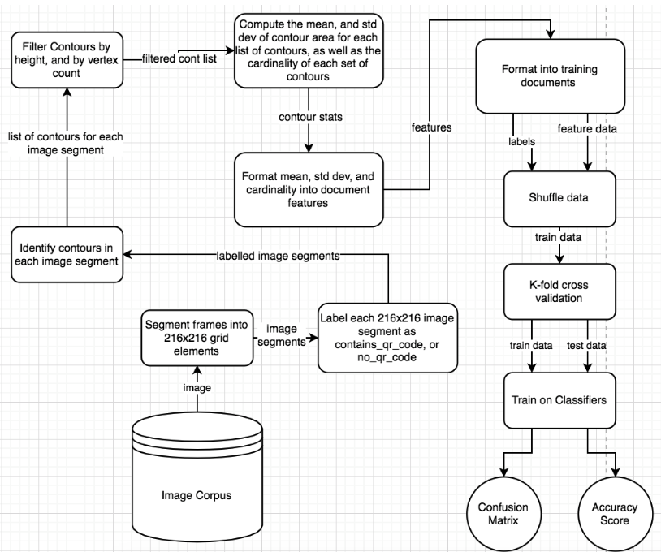
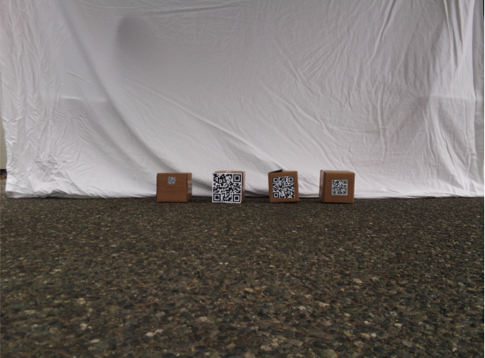

# Computer Vision QR Code Classification

Authors:
Avery Kushner, Derek Siemens

## Background
Applications of automating package pickup and deliveries exist across multiple industries, from moving freight in warehouses, to delivering medical and emergency supply kits to rural areas. This project focuses on moving medical supplies from airstrip depots to rural areas, where ground travel is slow and infeasible. A UGV can be leveraged to enter a depot area, collect a QR code labelled package, and return to a UAV such as a drone to be flown to a drop off zone.

The application intended for this particular classification problem is an autonomous Raspberry Pi powered vehicle system which navigates an environment searching for objects labelled with QR codes. The environment intended is an outdoor 3 sided open canvas tent containing 4x4 inch cardboard boxes labelled with QR codes, codes which vary in dimension. This depot tent will be located on a tarmac airstrip.

This project was conducted in 3 distinct phases: data collection, data pre-processing, and data classification. First, 2592 × 1944 pixel image data was collected via Raspberry pi camera. Image data was broken down into 216 x 216 pixel segments via python script. Each segment was manually labelled as “contains_qr_code” for segments with QR codes in them, and “no_qr_code” for image without QR codes. Labelled image data was fed through an OpenCV [1] powered algorithm to find and extract relevant contour data. Contour data was then pre-processed into several features pertaining to the area of each contour. Finally, these features were compiled into training documents and tested with several classification algorithms. 
### Architecture

## Data collection

### Technologies
Our project utilizes a host of technologies to facilitate data collection, data pre-processing and data classification. A Raspberry pi [3], with an attached Raspberry pi camera [4] was used to gather image data. OpenCV’s python libraries were used for finding and processing contour data within the images [1]. Numpy was used for several mathematical calculations [5]. Finally, data classification tools were used from the sklearn python library.

### Image Collection Environment

Our anticipated environment is a canvas tent located on airstrip tarmac containing packages with QR codes. To simulate this environment, we erected a gazebo to account for top light blockage. A white sheet was hung to mimic the white walls of a canvas tent. To simulate labelled packages we placed 4x4 inch boxes spaced 4 inches apart near the white sheet wall. Each box had QR code labels pasted on their surfaces of varying aspect ratios between 1x1 and 4x4 inches. The variant dimension of QR codes is intended to increase the robustness of our data. 

### Image Properties
The camera was positioned at varying distances between 0.25 and 3 meters from the QR code labelled boxes. At each distances, images were captured at 4 different angles in relation to the boxes. A total of 52 images was collected.

## Data Pre-Processing
After the data collection phase of our project, all of our data was in the form of images so preprocessing was required before we would be able to do anything meaningful or useful with the data. OpenCV was used to preprocess and extract contour information from our image dataset. OpenCV (Open Source Computer Vision Library) is an open source computer vision and machine learning software library built to provide a common infrastructure for computer vision applications and to accelerate the use of machine perception in the commercial products [1].

###  Image Processing
Our first step data pre-processing was to break down the images into smaller pieces, 216x216, via python script. As classifying whether a photo had or didn't have a QR code was not extremely informative, this allowed us to classify segments of the image as having a QR code or not, enriching the value of the classification. 

Our second step was to apply a grayscale filter to the image and then apply thresholding to render the image in a binary fashion, black or white. Thresholding proved to be very important in the next steps for extracting information from the images. Exploration was required to find the best threshold value and method. For example we had tried using adaptive thresholding which picks its threshold value dynamically based on the pixels it finds around it in a set block size, allowing the user to adjust block size. While this did proved to be very effective, it only did so at its fine tuned distance. It did not work well across our whole data set, so we opted for using normal thresholding with a fine tuned threshold value of 120. 

### Contour Extraction
Contours were identified within the given image segment, via the OpenCV’s findContours() function [6]. A contour being defined as “a curve joining all the continuous points (along the boundary), having the same color or intensity” [2]. As you might imagine, objects like QR codes hold lots of contours with consistent size and shape, these contours and all others found in the images would form the basis of our training data set used for classification.

### Training Data Set Creation
To create our training data set, we took the images from our data collection, divided them into 216x216 segments. We filtered some of the segments as their contours may just add noise to our data set. After that we labeled them with their respective class. Each image segment was fed through a series of OpenCv powered algorithms to extract and filter appropriate contours. Contours we’re filtered based on specified height, and vertice count ranges. Putting a lower and upper bound on the height of a contour filters out noise in the data, such as insignificantly small contours, and massively large contours such as a bounding box on the entire image segment. We then took this data and extrapolated statistics from it, including the mean and standard deviation of the area that a contour occupied as well as how many contours were in an image segment, cardinality.

## Data Mining
Prior to training our classifier, the data was shuffled, to ensure randomness for K-fold validation. With shuffled data, the K-fold cross validation algorithm [7] was employed in order to accurately score our classifier, and compute the confusion matrix [8]. We determined K=10 to be a reasonable grouping factor. See figure 7 for a code level description of the training method.

Finally, we ran our training function on 4 different classification algorithms obtained from the sklearn python library [9]:
* Gaussian Naive Bayes [10]
* Logistic Regression [15]
* Support Vector Machine [11]
* Decision Tree [12]
From each obtaining it’s accuracy score, and its confusion matrix.

## Results

### Gaussian Naive Bayes
Recall: 89.7%
Precision: 92.9%
F-measure: 91.3%

| Gaussian Naive Bayes Confusion Matrix | Predicted: Yes | Predicted: No |
|---------------------------------------|----------------|---------------|
| Actual: Yes                           | 234            | 27            |
| Actual: No                            | 18             | 139           |

### Logistic Regression
Recall: 88.9%
Precision: 93.2%
F-measure: 90.1%

| Logistic Regression Confusion Matrix | Predicted: Yes | Predicted: No |
|--------------------------------------|----------------|---------------|
| Actual: Yes                          | 232            | 29            |
| Actual: No                           | 17             | 140           |

### Support Vector Machine
Recall: 93.9%
Precision: 76.8%
F-measure: 84.5%

| Support Vector Machine Confusion Matrix | Predicted: Yes | Predicted: No |
|-----------------------------------------|----------------|---------------|
| Actual: Yes                             | 245            | 16            |
| Actual: No                              | 74             | 83            |

### Decision Tree (HoeffdingTree)
Recall: 89.7%
Precision: 92.9%
F-measure: 91.3%

| Decision Tree Confusion Matrix | Predicted: Yes | Predicted: No |
|--------------------------------|----------------|---------------|
| Actual: Yes                    | 234            | 27            |
| Actual: No                     | 18             | 139           |

## Discussion
As can be seen from the output of the classifiers used above, we found that our data is biased towards true positives. This is due to unsatisfactory conditions in the data collection phase. The anticipated concrete, is relatively contour free, while the concrete that our image data contains is filled with contours from the pebbles embedded within it. As a result, we chose to omit much of the concrete from our training data. This should be corrected with more training data on future iterations of our model. 

| Classifier                    | AUC Score (Desc Order) |
|-------------------------------|------------------------|
| Logistic Regression           | 0.9599                 |
| Gaussian Naive Bayes          | 0.9357                 |
| Decision Tree (HoeffdingTree) | 0.9351                 |

Upon comparing the AUC score and f-measure of our classifiers, we found that most classifiers perform well on our training data. While Naive Bayes and Decision tree produce similar results, Logistic regression produced the highest AUC indicating high precision. Naive Bayes and Decision tree have a high TP rate, while Logistic regression boasts a slightly lower FP rate. Overall, the results are very similar across the top performing classifiers, while Logistic regression has the best balance between f-measure score, and AUC. This balance between f-measure and score results in Logistic regression the best classifier for the data gathered.

SVM performs approximately 5% worse than each of the other classifiers used in this project. One possible explanation for this drop in performance is that our training data has a small feature set. SVM takes advantage of a large feature set to make discrete classifications by separating data by a hyperplane with dimension proportional to the size of the feature set. Since our dataset only contains 3 features, our data is not well fit for SVM classification. Furthermore, since discrete classifications are made for each training instance in contrast to a class probability, there is potentially less room for error than probability based classifiers such as Naive Bayes, and Logistic regression.

SVM performs approximately 5% worse than each of the other classifiers used in this project. One possible explanation for this drop in performance is that our training data has a small feature set. SVM takes advantage of a large feature set to make discrete classifications by separating data by a hyperplane with dimension proportional to the size of the feature set. Since our dataset only contains 3 features, our data is not well fit for SVM classification. Furthermore, since discrete classifications are made for each training instance in contrast to a class probability, there is potentially less room for error than probability based classifiers such as Naive Bayes, and Logistic regression.

Further iterations on this classification model, should aspire to include more features to potentially increase precision, data separability, and take advantage of SVM’s kernel trick.

## References

[1] “About,” OpenCV. [Online]. Available: https://opencv.org/about/. [Accessed: 19-Nov-2019].

[2] “Contour Approximation Method,” OpenCV. [Online]. Available: https://docs.opencv.org/3.4/d4/d73/tutorial_py_contours_begin.html. [Accessed: 20-Nov-2019].

[3] “Teach, Learn, and Make with Raspberry Pi – Raspberry Pi,” Teach, Learn, and Make with Raspberry Pi – Raspberry Pi. [Online]. Available: https://www.raspberrypi.org/. [Accessed: 20-Nov-2019].

[4] “Buy a Camera Module V2 – Raspberry Pi,” Buy a Camera Module V2 – Raspberry Pi. [Online]. Available: https://www.raspberrypi.org/products/camera-module-v2/. [Accessed: 20-Nov-2019].

[5] “NumPy,” NumPy. [Online]. Available: https://numpy.org/. [Accessed: 20-Nov-2019].

[6] “Structural Analysis and Shape Descriptors,” Structural Analysis and Shape Descriptors - OpenCV 2.4.13.7 documentation. [Online]. Available: https://docs.opencv.org/2.4/modules/imgproc/doc/structural_analysis_and_shape_descriptors.html. [Accessed: 20-Nov-2019].

[7] “sklearn.model_selection.KFold,” scikit. [Online]. Available: https://scikit-learn.org/stable/modules/generated/sklearn.model_selection.KFold.html. [Accessed: 20-Nov-2019].

[8] “sklearn.metrics.confusion_matrix,” scikit. [Online]. Available: https://scikit-learn.org/stable/modules/generated/sklearn.metrics.confusion_matrix.html. [Accessed: 20-Nov-2019].

[9] “learn: machine learning in Python - scikit-learn 0.16.1 documentation,” scikit. [Online]. Available: https://scikit-learn.org/. [Accessed: 20-Nov-2019].

[10] “sklearn.naive_bayes.GaussianNB,” scikit. [Online]. Available: https://scikit-learn.org/stable/modules/generated/sklearn.naive_bayes.GaussianNB.html. [Accessed: 20-Nov-2019].

[11] “sklearn.svm.SVC,” scikit. [Online]. Available: https://scikit-learn.org/stable/modules/generated/sklearn.svm.SVC.html. [Accessed: 20-Nov-2019].

[12] “sklearn.tree.DecisionTreeClassifier,” scikit. [Online]. Available: https://scikit-learn.org/stable/modules/generated/sklearn.tree.DecisionTreeClassifier.html. [Accessed: 20-Nov-2019].

[14] “What is a QR Code?,” What is a QR Code? | QRcode.com | DENSO WAVE. [Online]. Available: https://www.qrcode.com/en/about/. [Accessed: 20-Nov-2019].

[15] “sklearn.linear_model.LogisticRegression,” scikit. [Online]. Available: https://scikit-learn.org/stable/modules/generated/sklearn.linear_model.LogisticRegression.html. [Accessed: 21-Nov-2019].

